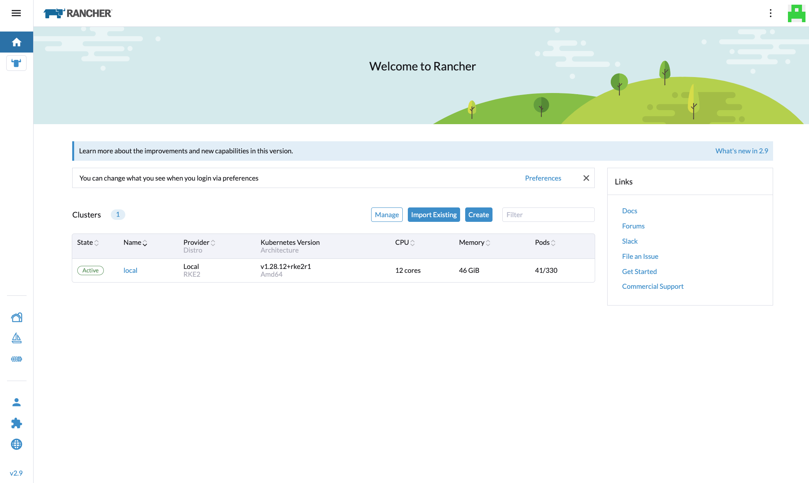
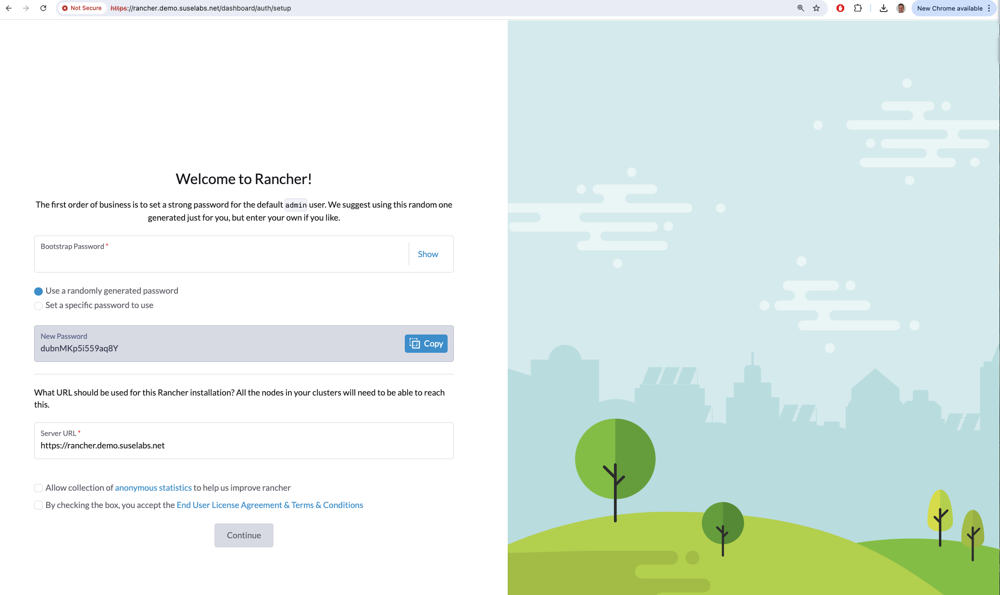

# aws-rancher-demo
Terraform to bootstrap DevTest HA RKE2 cluster with Rancher Manager on AWS EC2 

## Rancher on AWS


## Overview

This repo contains some terraform and deployment scripts to deploy a 3 node RKE2 cluster 
on SUSE SLES 15 instances and deploy Rancher Manager.

The deployment differs from the Rancher Quickstart that the app deployments are not 
performed by terraform to show the details in a clear form.  Additionally there are
load balancers for kubeapi and rancher services.  Self signed certificates are used.

Local commands needed:
* terraform
* kubectl
* helm
* direnv or add `export KUBECONFIG=./local/admin.conf` to your shell

## Configuration
The terraform uses `./tf/terraform.tfvars` (see `./tf/terraform.tfvars.example` to copy)  
for the infra, edit as desired.  
Different cluster instances can be created using different `prefix`
and `route53_subdomain` variable values.

You will need a route53 domain and hosted zone for the subdomain and DNS entries to 
be created in, update the `route53_zone_id` and `route53_domain` variables accordingly.

terraform.tfvars has a couple of CIDRs for specific IP addresses (ip_cidr_me, ip_cidr_work)
that are allowed full ingress, set these as required, home IP, office IP for example.

The "params.sh" script is included by the install scripts to set various 
variables for ssh and software versions.  
At time on initial commit the version values are:
```
# Params.sh

# params used in deployment scripts

# aws access
SSH_USERNAME=ec2-user
SSH_KEY=/Users/myuser/.ssh/awsmyuser
SSH_OPTS="-o StrictHostKeyChecking=no -i $SSH_KEY"

# rke2
#RKE2_VERSION="v1.27.10+rke2r1"
RKE2_VERSION="v1.28.12+rke2r1"
RKE2_TOKEN="myjointoken"

# rancher
RANCHERVERSION="2.9.0"
BOOTSTRAPADMINPWD=admin
```

## Installation

### Provision Infra for the cluster
```
cd tf
terraform init

# run terraform plan until happy with what will be deployed..
terraform plan

# apply when ready
terraform apply -auto-approve

cd ..
```

### Clean local subdirectory from any previous runs
```
./00--clean-local-dir
```

### RKE2 cluster install 

RKE2 is installed on master1 using the script:
```
./01-install-rke2.sh

[2024-08-20 11:23:26 INFO] Collecting terraform output values..
cluster1-ran1.demo.suselabs.net 54.225.73.102 172.20.1.95
cluster1-ran2.demo.suselabs.net 44.206.173.186 172.20.1.155
cluster1-ran3.demo.suselabs.net 34.227.34.172 172.20.1.150

[2024-08-20 11:23:40 STARTED] Installing initial RKE2 node (HOST: cluster1-ran1.demo.suselabs.net IP: 54.225.73.102 172.20.1.95)..
[2024-08-20 11:23:40 INFO] \__Creating cluster config.yaml..
[2024-08-20 11:23:44 INFO] \__Installing RKE2 (ran1)..
[2024-08-20 11:23:49 INFO] \__Starting rke2-server.service..
[2024-08-20 11:24:45 INFO] \__Waiting for kubeconfig file to be created..
[2024-08-20 11:24:46 INFO]  \__Cluster is now configured..
[2024-08-20 11:24:46 INFO] \__Downloading kube admin.conf locally..
[2024-08-20 11:24:52 INFO] \__adding kubectl link to bin..
[2024-08-20 11:24:56 DURATION] 1 minutes and 30 seconds elapsed.
[2024-08-20 11:24:56 INFO] function rke2nodewait: for node 1
[2024-08-20 11:24:56 INFO] \_Waiting for RKE2 cluster node (54.225.73.102) to be Ready..
[2024-08-20 11:25:20 INFO]  \__RKE2 cluster nodes are Ready:
NAME            STATUS   ROLES                       AGE   VERSION
cluster1-ran1   Ready    control-plane,etcd,master   43s   v1.28.12+rke2r1
[2024-08-20 11:25:21 INFO] \_Waiting for RKE2 cluster to be fully initialised..
0
[2024-08-20 11:25:52 INFO]  \__RKE2 new cluster node is now initialised.
[2024-08-20 11:25:52 DURATION] 2 minutes and 26 seconds elapsed.

[2024-08-20 11:25:52 STARTED] Installing other RKE2 nodes..

[2024-08-20 11:25:52 INFO] function rke2joinnodex: for node 2
[2024-08-20 11:25:52 INFO] \_Joining RKE2 cluster node (44.206.173.186)..
[2024-08-20 11:25:52 INFO] \__Creating RKE2 join config.yaml..
[2024-08-20 11:25:56 INFO] \__Installing RKE2 (ran2)..
[2024-08-20 11:26:01 INFO] \__Starting rke2-server.service..
[2024-08-20 11:26:51 DURATION] 3 minutes and 25 seconds elapsed.

[2024-08-20 11:26:51 INFO] function rke2nodewait: for node 2
[2024-08-20 11:26:51 INFO] \_Waiting for RKE2 cluster node (44.206.173.186) to be Ready..
1.1.0
[2024-08-20 11:27:13 INFO]  \__RKE2 cluster nodes are Ready:
NAME            STATUS   ROLES                       AGE     VERSION
cluster1-ran1   Ready    control-plane,etcd,master   2m36s   v1.28.12+rke2r1
cluster1-ran2   Ready    control-plane,etcd,master   26s     v1.28.12+rke2r1
[2024-08-20 11:27:14 INFO] \_Waiting for RKE2 cluster to be fully initialised..
0
[2024-08-20 11:27:45 INFO]  \__RKE2 new cluster node is now initialised.
[2024-08-20 11:27:45 DURATION] 4 minutes and 19 seconds elapsed.

[2024-08-20 11:27:45 INFO] function rke2joinnodex: for node 3
[2024-08-20 11:27:45 INFO] \_Joining RKE2 cluster node (34.227.34.172)..
[2024-08-20 11:27:45 INFO] \__Creating RKE2 join config.yaml..
[2024-08-20 11:27:49 INFO] \__Installing RKE2 (ran3)..
[2024-08-20 11:27:54 INFO] \__Starting rke2-server.service..
[2024-08-20 11:28:42 DURATION] 5 minutes and 16 seconds elapsed.

[2024-08-20 11:28:42 INFO] function rke2nodewait: for node 3
[2024-08-20 11:28:42 INFO] \_Waiting for RKE2 cluster node (34.227.34.172) to be Ready..
0
[2024-08-20 11:28:43 INFO]  \__RKE2 cluster nodes are Ready:
NAME            STATUS   ROLES                       AGE    VERSION
cluster1-ran1   Ready    control-plane,etcd,master   4m5s   v1.28.12+rke2r1
cluster1-ran2   Ready    control-plane,etcd,master   115s   v1.28.12+rke2r1
[2024-08-20 11:28:43 INFO] \_Waiting for RKE2 cluster to be fully initialised..
[2024-08-20 11:29:25 INFO]  \__RKE2 new cluster node is now initialised.
[2024-08-20 11:29:25 DURATION] 5 minutes and 59 seconds elapsed.

[2024-08-20 11:29:25 COMPLETED] Done.
```

note: the scripts source include `load-tf-output.sh` which loads bash variables from 
the terraform output values.  Addionally there is a `utils.sh` which is included to
provide some log highlighting functions and elapsed duration values.

### Check local kubeconfig access
```
$ kubectl --kubeconfig=local/admin.conf get nodes
NAME            STATUS   ROLES                       AGE     VERSION
cluster1-ran1   Ready    control-plane,etcd,master   8m17s   v1.28.12+rke2r1
cluster1-ran2   Ready    control-plane,etcd,master   6m7s    v1.28.12+rke2r1
cluster1-ran3   Ready    control-plane,etcd,master   4m11s   v1.28.12+rke2r1
```

### Rancher install

Rancher install is handled by running the script:
```
./02-install-rancher.sh

[2024-08-20 11:35:23 INFO] Collecting terraform output values..
cluster1-ran1.demo.suselabs.net 54.225.73.102 172.20.1.95
cluster1-ran2.demo.suselabs.net 44.206.173.186 172.20.1.155
cluster1-ran3.demo.suselabs.net 34.227.34.172 172.20.1.150

[2024-08-20 11:35:37 STARTED] Installing Rancher Manager..
[2024-08-20 11:35:37 INFO] \__Add helm repo jeystack (for cert-manager)..
"jetstack" already exists with the same configuration, skipping
Hang tight while we grab the latest from your chart repositories...
...Successfully got an update from the "rancher-prime" chart repository
...Successfully got an update from the "neuvector" chart repository
...Successfully got an update from the "jetstack" chart repository
...Successfully got an update from the "rancher-latest" chart repository
Update Complete. ⎈Happy Helming!⎈

[2024-08-20 11:35:38 INFO] \__helm install cert-manager jetstack/cert-manager ..
NAME: cert-manager
LAST DEPLOYED: Tue Aug 20 11:35:39 2024
NAMESPACE: cert-manager
STATUS: deployed
REVISION: 1
TEST SUITE: None
NOTES:
cert-manager v1.15.3 has been deployed successfully!

[2024-08-20 11:36:03 DURATION] 0 minutes and 40 seconds elapsed.

[2024-08-20 11:36:03 INFO] \__Add helm repo rancher-latest..
Hang tight while we grab the latest from your chart repositories...
...Successfully got an update from the "neuvector" chart repository
...Successfully got an update from the "jetstack" chart repository
...Successfully got an update from the "rancher-latest" chart repository
Update Complete. ⎈Happy Helming!⎈

[2024-08-20 11:36:04 INFO] \__helm install rancher (version=2.9.0)..
NAME: rancher
LAST DEPLOYED: Tue Aug 20 11:36:05 2024
NAMESPACE: cattle-system
STATUS: deployed
REVISION: 1
TEST SUITE: None
NOTES:
Rancher Server has been installed.

NOTE: Rancher may take several minutes to fully initialize. Please standby while Certificates are being issued, Containers are started and the Ingress rule comes up.

If you provided your own bootstrap password during installation, browse to https://rancher.demo.suselabs.net to get started.

If this is the first time you installed Rancher, get started by running this command and clicking the URL it generates:

echo https://rancher.demo.suselabs.net/dashboard/?setup=$(kubectl get secret --namespace cattle-system bootstrap-secret -o go-template='{{.data.bootstrapPassword|base64decode}}')

To get just the bootstrap password on its own, run:

kubectl get secret --namespace cattle-system bootstrap-secret -o go-template='{{.data.bootstrapPassword|base64decode}}{{ "\n" }}'

Happy Containering!

[2024-08-20 11:36:09 INFO] \__Waiting for Rancher Manager to be fully initialised..
3.0
[2024-08-20 11:36:51 INFO]  \__Rancher is now initialised.

[2024-08-20 11:36:51 DURATION] 1 minutes and 28 seconds elapsed.
[2024-08-20 11:36:51 COMPLETED] Done.
```

## helm cli check
```
$ helm list -n cattle-system
NAME           	NAMESPACE    	REVISION	UPDATED                                	STATUS  	CHART                          	APP VERSION
rancher        	cattle-system	1       	2024-08-20 11:36:05.394343 +0100 BST   	deployed	rancher-2.9.0                  	v2.9.0
rancher-webhook	cattle-system	1       	2024-08-20 10:38:31.322061483 +0000 UTC	deployed	rancher-webhook-104.0.0+up0.5.0	0.5.0


$ helm history rancher -n cattle-system
REVISION	UPDATED                 	STATUS  	CHART        	APP VERSION	DESCRIPTION
1       	Tue Aug 20 11:36:05 2024	deployed	rancher-2.9.0	v2.9.0     	Install complete
```

### Example install output
[Example Install Output](docs/example-install-output.md)


### UI Access
If all was successful, access the cluster at 
```
open https://rancher.<route53_subdomain>.<route53_domain>
```
The admin user bootstrap password in the script has been set to "admin"




## Clean up
```
cd tf
terraform destroy -auto-approve
cd ..
./00-clean-local-dir
```

note: Added `./ssh/known_hosts` entries for the hosts should be manually tidied to avoid future instances on same IPs rejecting interactive ssh connections


## Current Issues
* Security, 443 and 8089 (cert-manager) are open to 0.0.0.0/0 ingress to allow downstream clusters to be installed using EC2 etc providers.
  Access to cert-manager is required in this configuration for downstream clusters to validate the Rancher Manager self-signed-cert.


