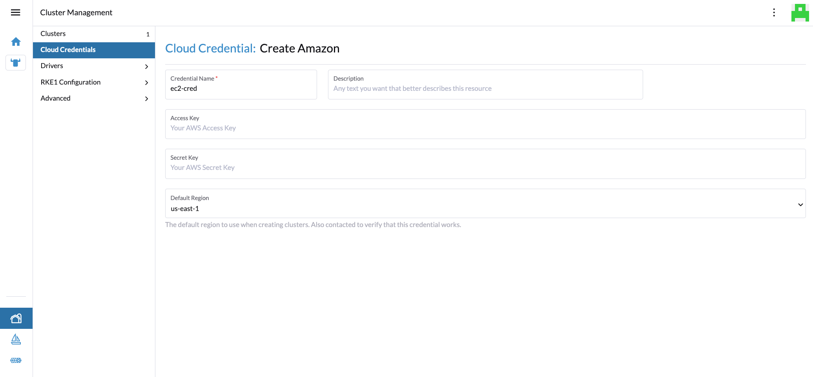

# Example create cloud credentials

To be able to provision to a cloud, the cloud credentials need to be setup the first time.  

Click Create to configure a new cloud credential  

Select Amazon {in out example for EC2)  

Enter Access Key and Secret for the EC2 region and save.  

