# Example create downstream cluster

Rancher provides the ability to create managed clusters on various downstream infra.  
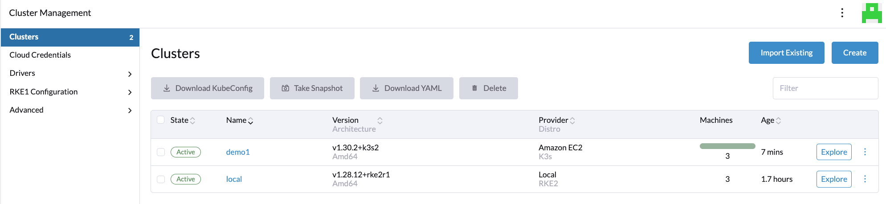

Before creating a cluster the node provider credentials need to be configured,  
example config:  
[Example Create EC2 Credentials](./create-cloud-credentals.md)  

## Create downstream cluster on ec2

To create a new cluster, click Create on the Cluster Management dashboard and select node provider Amazon EC2  

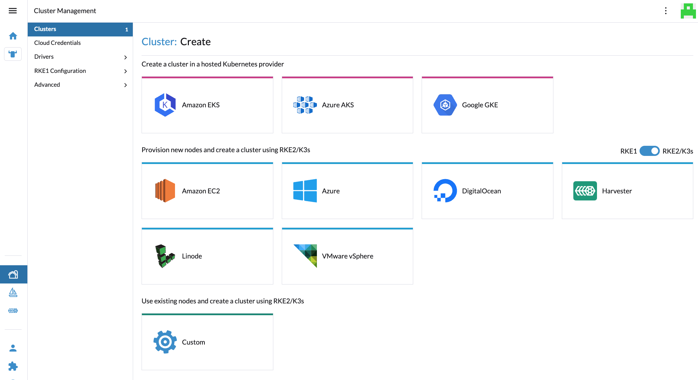  

Enter the cluster details, note the region, availability zone and vpc where rancher is deployed and access setup.  
The cluster nodes need an IAM instance profile for Kubernetes, ex: rancher_instance_profile used below.  
[Example IAM rancher instance profile setup](./downstream-cluster-instance-profile.md)

The AMI used here is SUSE SLES 15, ensure the Root Disk Device is sized for the AMI being used.  
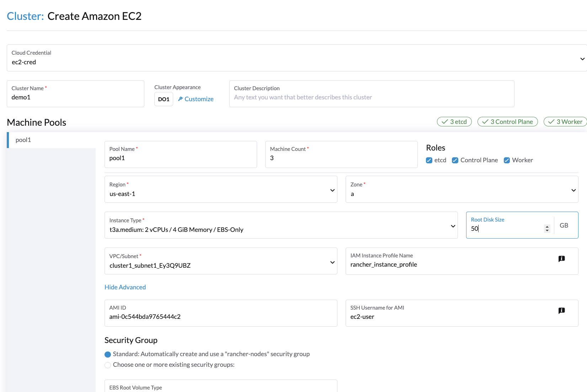  

The second half of the create page is related to the kuberenetes config, the example has selected a k3s cluster of version v1.30.2  
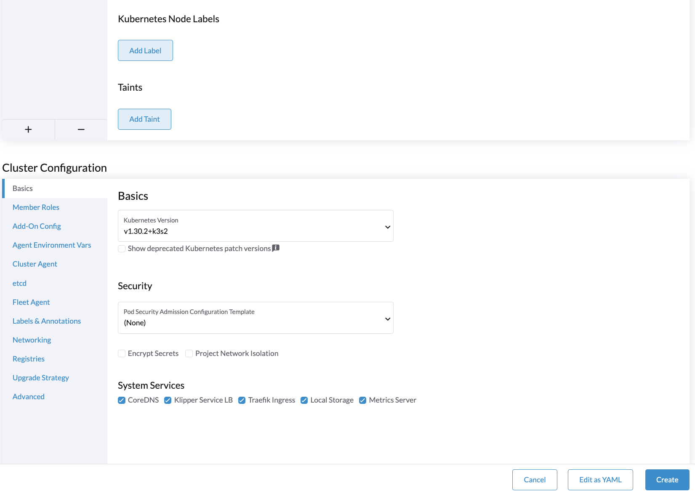  

It takes a while for the instances to be configured and run cloud-init which downloads config from the rancher manager..  
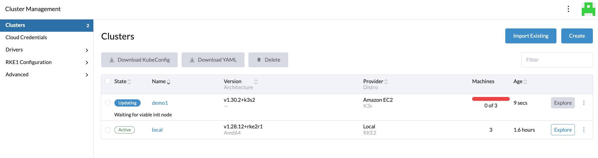  

Clicking on the cluster, there are various tabs, the Machine Pool shows the current status for each cluster node..  
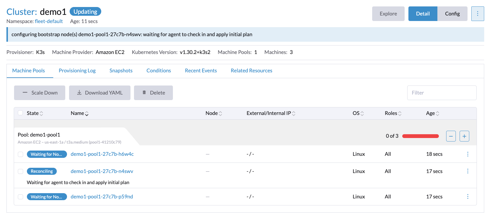  

When a node has complted it's configuration it displays "Running"  
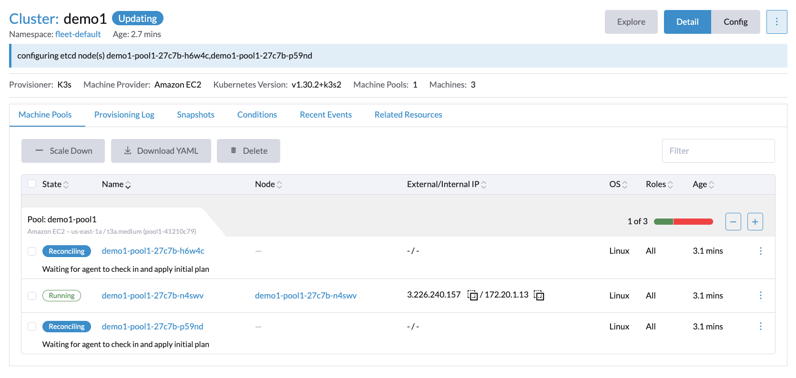  

## Instances can be seen on AWS EC2 console

The corresponding instances can be viewed on the AWS EC2 console, where the Rancher Machine names match the instance names.  
The EC2 instance console can be used to view initial bootsrtapping as well as ssh using the autogenerated ssh key which can be downloaded from the Rancher Machine Pool view using the "three dots" menu on the RHS of the entry.  
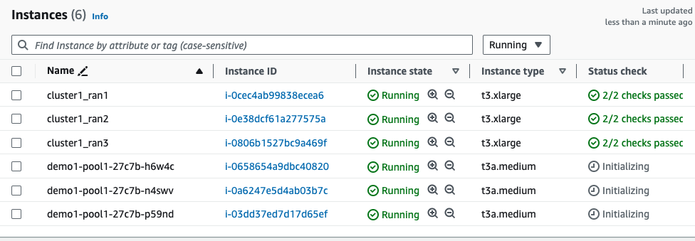  

## Cluster running

When the cluster is fully Running the Explore cluster is available.  
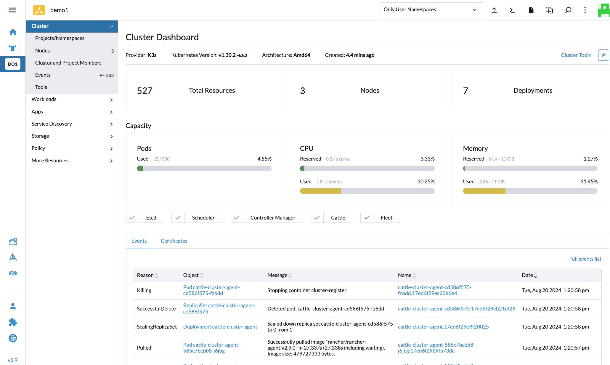  

## Access cluster nodes (Machines)

Clicking on the cluster nodes a shell can be opened directly in the Rancher UI..  
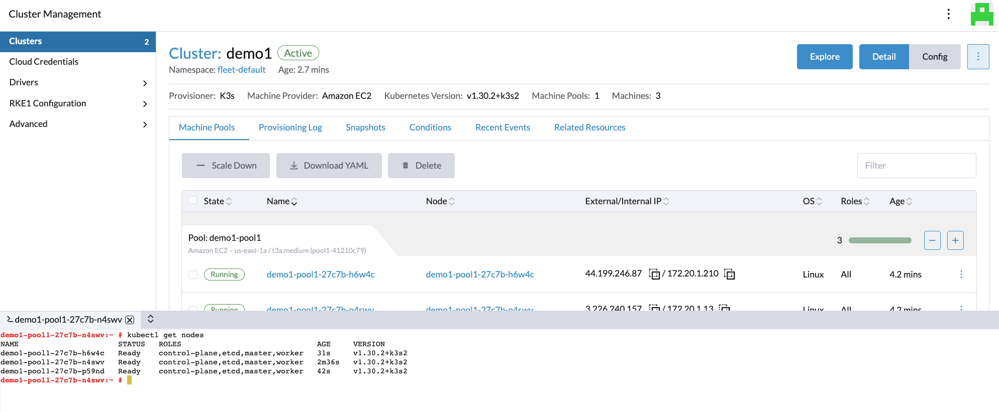  

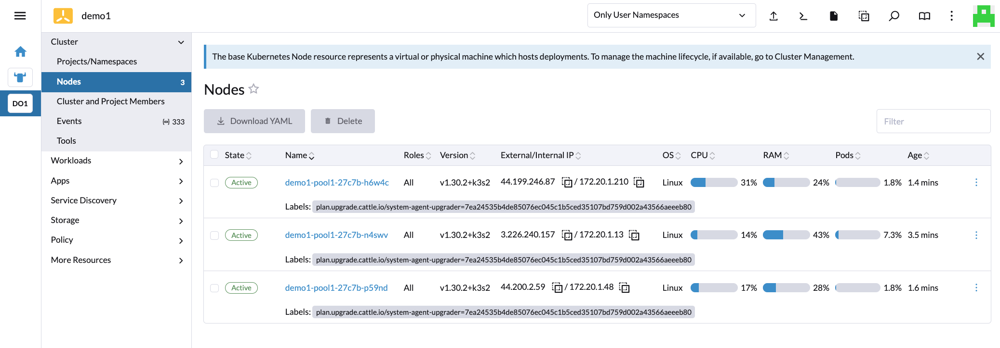  

