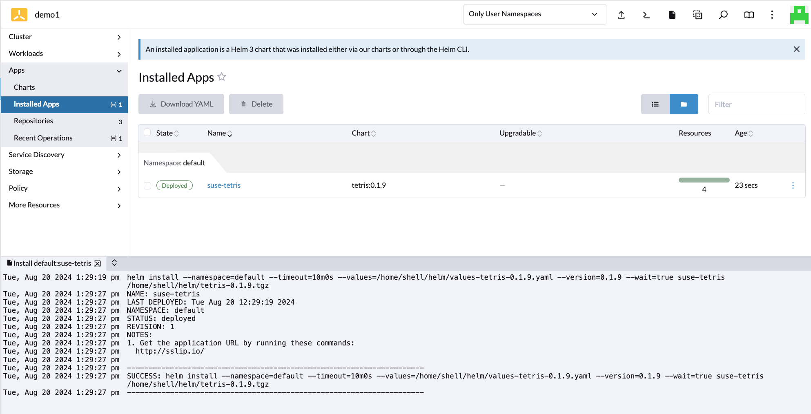
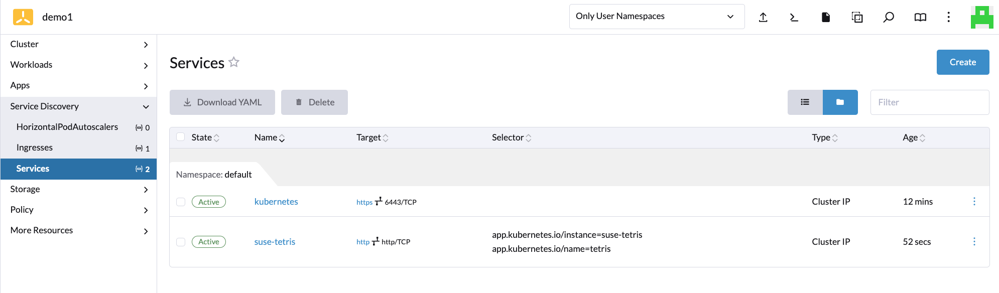
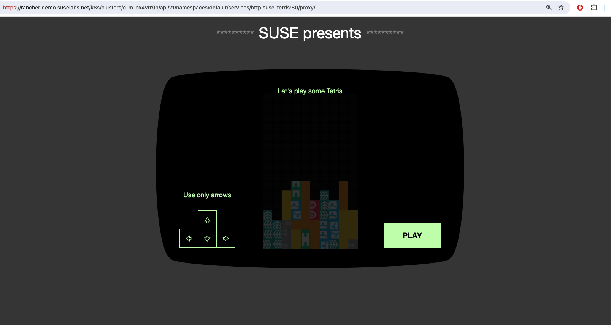

# Example sample app deployment to downstream cluster

## Deploy

A sample repo was added in demo1 cluster **Explore -> Apps -> Repositories**  
Find an app using the Apps Charts search and click **Install**  
  

The application components and be explored and the app accessed via the Service (or Ingress if configured)  
  

Note when accessing a NodePort service the service is proxied be the Rancher Manager web app by default:  
  

